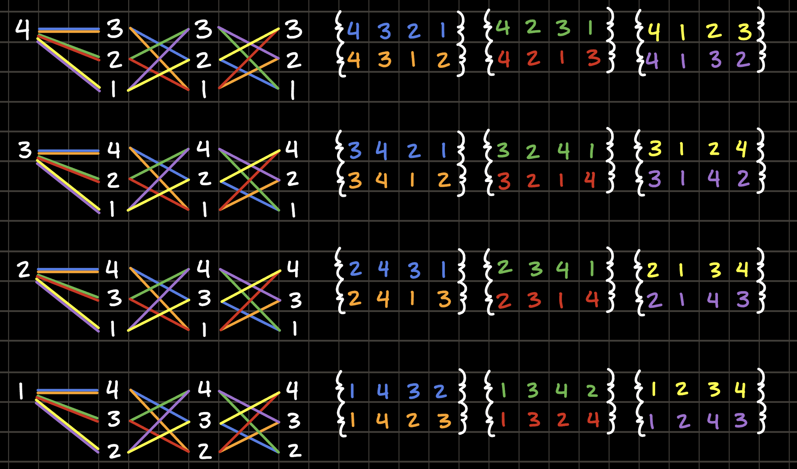
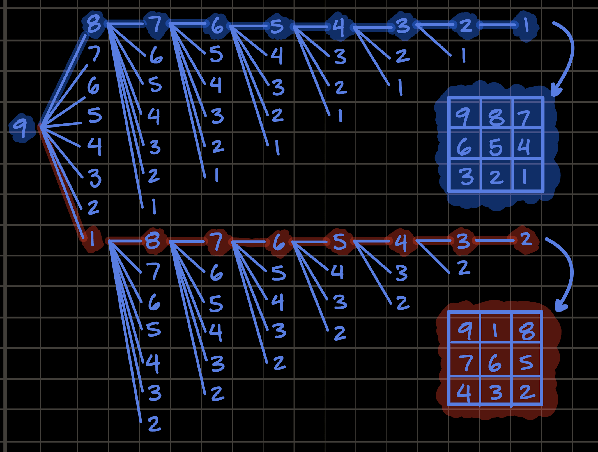
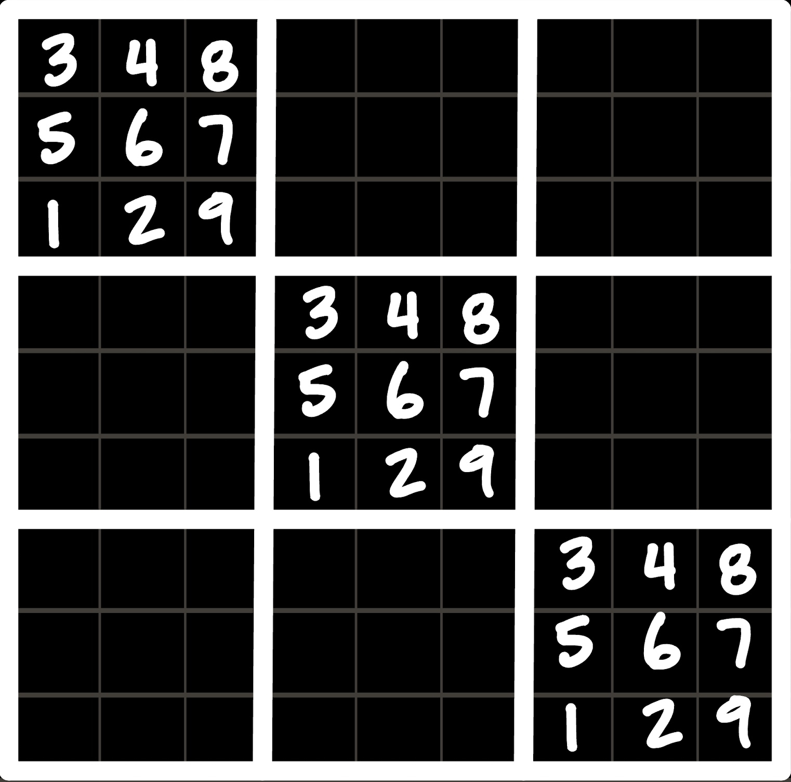
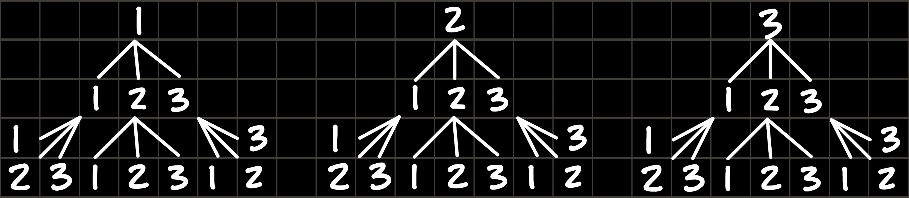
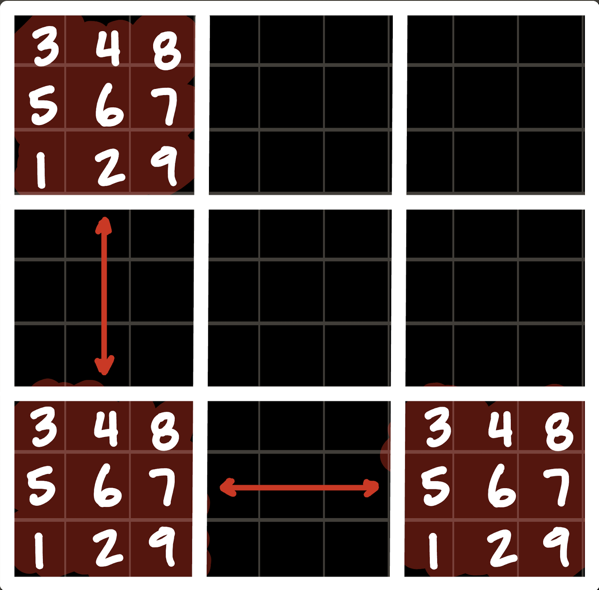
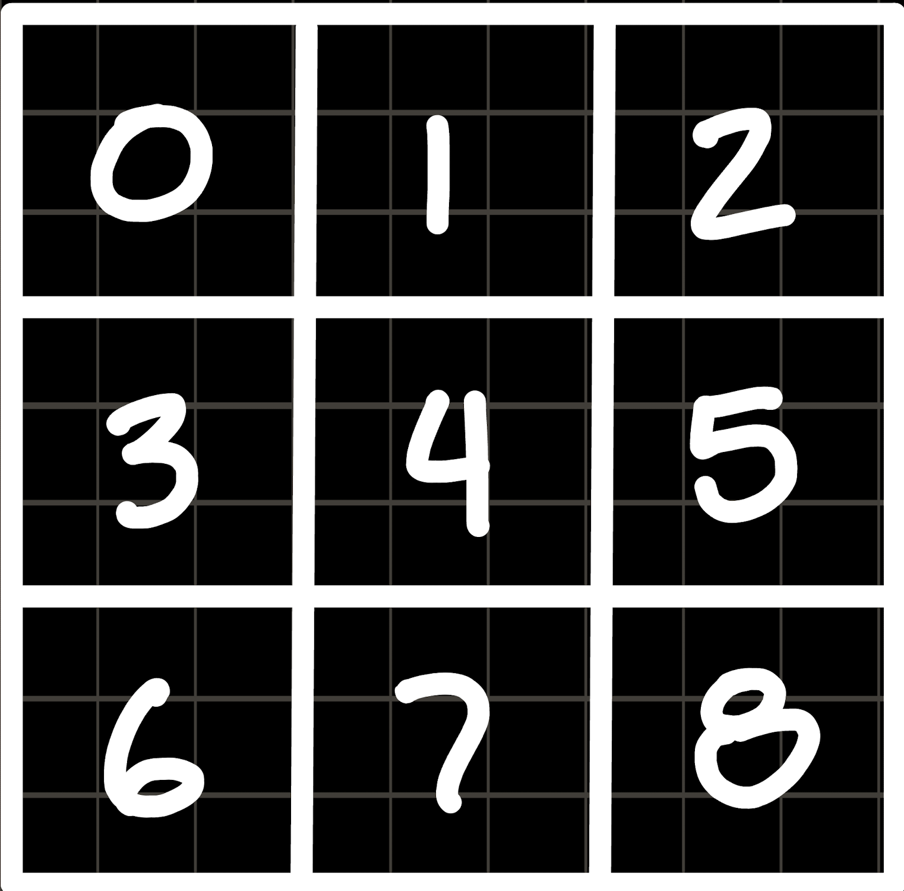
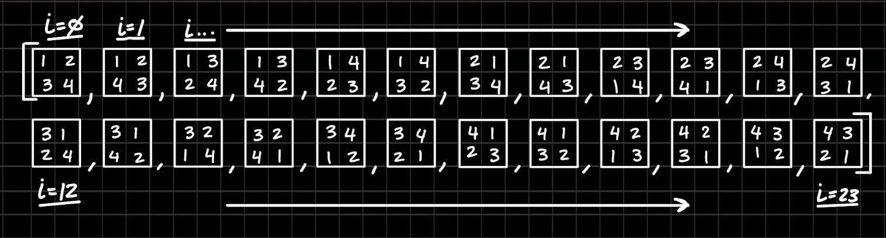
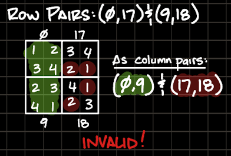
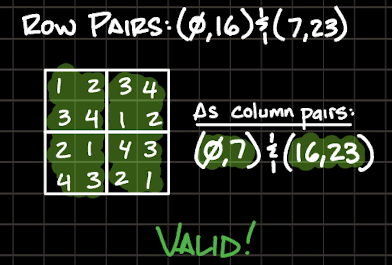

# CSPB-2270-Data-Structs-Sudoku-Final

This is a final project for the 2270 Data Structures class as a part of the computer science program at the University of Colorado Boulder. The structure of the project is an open ended exploration of any data structure or algorithm in C++.

This project includes a [Tasks.json](./.vscode/tasks.json) file for convenience to run build and tests. Running the application will not result in any output (as `main.cpp`) does not contain any code, but passing the tests should indicate things are in order.

## Build & Run Commands

Below are the main commands to configure, build, run, and test this C++ Sudoku project, as defined in [`.vscode/tasks.json`](./.vscode/tasks.json). You can run them from the root of the repository.

### 1. Configure and Build (Release)

```sh
cmake -S . -B build -DCMAKE_BUILD_TYPE=Release && cmake --build build
```

### 2. Build and Run the Application

```sh
cmake -S . -B build -DCMAKE_BUILD_TYPE=Release && cmake --build build && ./build/sudoku-structs
```

> **Note:** By default, `main.cpp` is empty, so running the application will not produce output unless you add your own code.

### 3. Build and Run Tests

```sh
cmake -S . -B build -DCMAKE_BUILD_TYPE=Release && cmake --build build && ctest --test-dir build --output-on-failure
```

You can copy and paste any of these commands into your terminal to build or test the project.

## Goal

Determine the number of valid layouts of a Sudoku puzzle exist. Sudoku's are a puzzle consisting of a 3 by 3 grid of squares each containing 9 cells, also arranged in 3 by 3. Each cell contains a single number 1 through 9, and each square must contain all of the numbers only a single time. A valid Sudoku board doesn't allow duplicates cell values in any row or column spanning 3 squares horizontally or vertically.

## Problem Solving

With 9 squares of 9 cells there are 81 values to find in a valid Sudoku board, but even this is a bigger problem then it seems at first. In order to start making progress it seems reasonable to start by breaking the problem into smaller more digestible chunks.

### Sub-Problem 1: All Square Permutations

_[See: SP1 All Square Permutations](/src/sp1_all_square_permutations.cpp) for relevant code._

The award for most intimidating name for a field of mathematics has long since been awarded (by myself and everyone I ask) to [Combinatorics](https://en.wikipedia.org/wiki/Combinatorics), but luckily its bark is much worse than it's bite. A 'Permutation' problem asks how many different arrangements of a set (where the order matters) can be found from a larger set of values, so to define the set for a Sudoku square:

$$
\text{values} = \{1, 2, \ldots, 9\}
$$

However, as is often the case the best way to develop an intuitive understanding of this is to shrink the problem into a more manageable scale so instead, let's start with a slightly more manageable set:

$$
\text{junior\text{-}values} = \{1, 2, 3, 4\}
$$

Then sketching it out by hand....



In total this is 24 permutations of the `junior-values` set. Since this is such a common problem in the world of combinatorics there exists a tool for this exact kind of calculation, the Factorial. A factorial `n!` is the product of each positive value less than `n` where n is an integer value. For example:

$$
4! = 4 \times 3 \times 2 \times 1 = 24
$$

Using a factorial it's easy to find the same result for the larger `values` set from above:

$$
9! = 9 \times 8 \times 7 \times 6 \times 5 \times 4 \times 3 \times 2 \times 1 = 362{,}880
$$

As you can imagine, sketching that out by hand is a recipe for wrist pain, it was still helpful to visualize this process as it would fit into the Sudoku domain:



### Sub-Problem 2: Brute Forcing Board Permutations

_[See: SP2 Brute Force All Board Permutations](/src/sp2_brute_force_all_board_permutations.cpp) for relevant code._

Perhaps you saw this coming, or perhaps like me this all still seems like a very solve-able problem, but it turns out this problem quickly grows beyond enormous. With the 'Square' permutations solved, it would only (seem to) make sense to build on that mostly uncomplicated success and extend our methodology. However, Sudoku defines a few rules that apply at the `Board` level which complicate things:

- No value (1-9) can repeat horizontally in a single row.
- No value (1-9) can repeat vertically in a single column.

Not only do these rules complicate things, but theres a `362,880` permutation iceberg on the horizon and it's headed this way. Not following the thought process through to step 2 (like I did) the enormity fails to see the enormous impact of this kind of number. By putting the rules aside and just considering the permutations, it quickly becomes apparent the enormity of this problem. Unlike step 1 this permutation problem does not require exclusivity, that is to say that any permutation could (in theory) appear in a valid solution up to 3 times:



And from this simple example its easy to contrive other examples with only 2 repetitions in a variety of positions which similarly do not break any of the specific rules. That is to say, this permutation allows repetition, unlike the `Square` solution. To get a better grasp of this problem, once again lets reduce the permutation count to just `n=3` and draw it out as a tree:



If you noticed that this suddenly feels a lot more complex, don't ignore that feeling. While the `Square` solution could be worked out with a factorial, the repetition iteration of this problem is instead exponential in it's representation:

$$
3^3 = 27
$$

As mentioned before, a permutation problem doesn't require that every member of the permutations be used in a solution, for example if you had.... a more unreasonable number of permutations like `362,880`, and `9` squares to a valid board, it would instead work out to be:

$$
362{,}880^9 = 1.0911069 \times 10^{50}
$$

And if that number seems like an unreasonable amount of compute, congratulations you are absolutely correct and have much better intuition than I do. The C++ code to do this work would look something like this:

```cpp
#include "board.hpp"

#include <vector>

static void fillBoardPermutations(
    std::size_t blockIndex, Board& board,
    const std::vector<square>& perms,
    std::vector<Board>& out)
{
    if (blockIndex == 9)
    {
        out.push_back(board);
        return;
    }

    for (std::size_t pi = 0; pi < perms.size(); ++pi)
    {
        board.setSquare(perms[pi], blockIndex);
        fillBoardPermutations(blockIndex + 1, board, perms, out);
    }
}

std::vector<Board> Board::generateAllBoardPermutationInstances()
{
    const std::vector<square>& perms = square::permutations;
    std::vector<Board> result;
    // IMPOSSIBLE result.reserve((9!)^9)
    Board b;
    fillBoardPermutations(0, b, perms, result);
    return result;
}
```

Now, assuming each iteration takes a single microsecond `(µs)` this still works out to:

$$
\frac{1.0911069 \times 10^{50}}{1 \times 10^{6}} = 1.0911069 \times 10^{44}
$$

Which is a silly amount of time, especially to wait for a final to just.... be done running. So it seems like it is time to step back and reconsider the approach.

### Sub-Problem 3: Row and Column Pruning

_[See: SP3 Row and Column Prune Board Permutations](/src/sp3_row_column_prune_board_permutations.cpp) for relevant code._

In the above figure where a Sudoku board is shown with the same `Square` permutation used 3 times in a single valid board the permutations are arranged diagonally so as to avoid violating the row and column rules. So what if you could use those to prevent having to check some permutations:



Here its easy to see that how a permutation disqualifies the use of the same permutation in both its neighbors in the rows and columns. Now assuming the use of 'row major' ordering and 0 indexing the squares can be identified as such:



Using these identifiers its easy to build a dictionary which can be used to prune out board permutations to try, and prevent some branch exploration:

```cpp
constexpr std::array<std::array<int, 4>, 9> RowColNeighborBlockIndices =
{{
    {{1, 2, 3, 6}},
    {{0, 2, 4, 7}},
    {{0, 1, 5, 8}},
    {{0, 4, 5, 6}},
    {{1, 3, 5, 7}},
    {{2, 3, 4, 8}},
    {{0, 3, 7, 8}},
    {{1, 4, 6, 8}},
    {{2, 5, 6, 7}},
}};
```

It's not entirely clear how many permutations this would prune from the results, but it's fair to say with such a significant number of `Board` permutations possible that the impact is not enough to make this a viable means of finding an answer.

### Sub-Problem 4: More Problem Shrinking

_[See: SP4 Row Column Independence 2x2](/src/sp4_row_column_independence_2x2.cpp) for relevant code._

Given the overwhelming number of possible permutations that need to be checked to find the solution to the problem the next goal will be to shrink the problem being solved. Brute forcing the `Board` permutations relied on a recursive method call structure which effectively created a nightmare depth of 9 loops inside of each other each running validation checking and needing to complete some `362,880` iterations to advance. Even the lifetime of the universe doesn't have that kind of time, so the question becomes, how do you get rid of as much nested looping as possible?

The key is breaking the problem into smaller pieces and abusing just a bit of [Set Theory](https://en.wikipedia.org/wiki/Set_theory), to bring it all back together. By thinking about the `Board` as two discrete sets, rows and columns, the size of the problem(s) shrinks dramatically. Since a column or row can only have at most 3 `Square`, the size of the problem decreases dramatically eliminating 6 nested loops worth of work required to find a solution. Additionally, by limiting the solution to finding all the permutations of a row or column (singular), the duplicate work of using the same permutations in other rows and columns does not need to be redone. To be clear this is still a huge amount of work with 3 nested loops remaining for both rows and columns:

$$
362{,}880^3 = (4.7784726 \times 10^{16}) \times 2
$$

The good news though is that number has a useable english name 47 quadrillion, seven hundred eighty-four trillion, seven hundred and twenty-six billion. Whereas I could not find an answer for the previous `10^(50)` values potential name, google just kept showing me pictures of Jeff Bezos and Elon Musk foaming at the mouth? Weird.

Anyway, as with previous examples the best way to vet this approach is to once again visualize it on a smaller set:



Importantly this time each solution from the `n=4` set has been pictured as a member of an array, giving them an index value which can be used to 'identify' them. With a smaller n of just 4, the size of the board also shrinks to only 2 by 2. Split into rows and columns this means finding all of the combinations of the above permutations which work as rows, and which work as columns. When a valid permutation of either row or column is found it is then stored as an array of two integers pointing to the above set.

This results in the following sets of pairs (each having 96 valid combinations):

```cpp
const std::vector<std::pair<int, int>> ValidRowPairs = {
    {0, 16}, {0, 17}, {0, 22}, {0, 23}, {1, 16}, {1, 17}, {1, 22}, {1, 23},
    {2, 10}, {2, 11}, {2, 20}, {2, 21}, {3, 10}, {3, 11}, {3, 20}, {3, 21},
    {4,  8}, {4,  9}, {4, 14}, {4, 15}, {5,  8}, {5,  9}, {5, 14}, {5, 15},
    {6, 16}, {6, 17}, {6, 22}, {6, 23}, {7, 16}, {7, 17}, {7, 22}, {7, 23},
    {8,  4}, {8,  5}, {8, 18}, {8, 19}, {9,  4}, {9,  5}, {9, 18}, {9, 19},
    {10, 2}, {10, 3}, {10, 12}, {10, 13}, {11, 2}, {11, 3}, {11, 12}, {11, 13},
    {12, 10}, {12, 11}, {12, 20}, {12, 21}, {13, 10}, {13, 11}, {13, 20}, {13, 21},
    {14, 4}, {14, 5}, {14, 18}, {14, 19}, {15, 4}, {15, 5}, {15, 18}, {15, 19},
    {16, 0}, {16, 1}, {16, 6}, {16, 7}, {17, 0}, {17, 1}, {17, 6}, {17, 7},
    {18, 8}, {18, 9}, {18, 14}, {18, 15}, {19, 8}, {19, 9}, {19, 14}, {19, 15},
    {20, 2}, {20, 3}, {20, 12}, {20, 13}, {21, 2}, {21, 3}, {21, 12}, {21, 13},
    {22, 0}, {22, 1}, {22, 6}, {22, 7}, {23, 0}, {23, 1}, {23, 6}, {23, 7}
};

const std::vector<std::pair<int, int>> ValidColumnPairs = {
    {0,  7}, {0,  9}, {0, 18}, {0, 23}, {1,  6}, {1, 11}, {1, 12}, {1, 17},
    {2, 13}, {2, 15}, {2, 19}, {2, 21}, {3,  6}, {3, 11}, {3, 12}, {3, 17},
    {4, 13}, {4, 15}, {4, 19}, {4, 21}, {5,  7}, {5,  9}, {5, 18}, {5, 23},
    {6,  1}, {6,  3}, {6, 20}, {6, 22}, {7,  0}, {7,  5}, {7, 14}, {7, 16},
    {8, 13}, {8, 15}, {8, 19}, {8, 21}, {9,  0}, {9,  5}, {9, 14}, {9, 16},
    {10, 13}, {10, 15}, {10, 19}, {10, 21}, {11, 1}, {11, 3}, {11, 20}, {11, 22},
    {12, 1}, {12, 3}, {12, 20}, {12, 22}, {13, 2}, {13, 4}, {13, 8}, {13, 10},
    {14, 7}, {14, 9}, {14, 18}, {14, 23}, {15, 2}, {15, 4}, {15, 8}, {15, 10},
    {16, 7}, {16, 9}, {16, 18}, {16, 23}, {17, 1}, {17, 3}, {17, 20}, {17, 22},
    {18, 0}, {18, 5}, {18, 14}, {18, 16}, {19, 2}, {19, 4}, {19, 8}, {19, 10},
    {20, 6}, {20, 11}, {20, 12}, {20, 17}, {21, 2}, {21, 4}, {21, 8}, {21, 10},
    {22, 6}, {22, 11}, {22, 12}, {22, 17}, {23, 0}, {23, 5}, {23, 14}, {23, 16}
};
```

### Sub-Problem 5: Try Rows and Check Columns from Smaller Set

_[See: SP5 Try Rows Check Columns 2x2](/src/sp5_try_rows_check_columns_2x2.cpp) for relevant code._

With 2 valid sets in hand, the last part of this solution becomes about using these sets to find a all of the unions of them which combine to create a valid 'Shidoku' (the smaller 2x2 cousin of Sudoku) `Board`. This process is eerily similar to the brute force approach above, but with constrained sets of valid rows and columns the space needed to find all the valid boards is reduced to a more manageable size. By first selecting two members of the `ValidRowPairs` set to try as a complete board, they can then be validated using the valid column pairs set:





Selecting a random example from the above sets it's easy to see how the two sets can be used to generate and check board permutations for the smaller 'Shidoku' permutation set. Ultimately this results in the file `all-shidoku-boards.csv` containing each of the 288 possible permutations of the 2x2 Shidoku board!

## Always the Problem: Time Constraints

The intent was to carry the `Try Rows and Check Columns` approach forward to the larger 3x3 Sudoku board, but I have run out of time to actually complete this next step as intended. As far as I can tell this approach would significantly reduce the number of permutations which need to be checked in order to find the total number of permutations of the full board. Copies of the outputted (result) data can be found as `.csv` files in the [data directory](./data/).

Thanks so much! @horaciovelvetine
